# Evaluation

This directory summarizes the different evaluation efforts to measure the
performance of Knative using confidential containers, and place it in relation
to well-known serverless benchmarks.

The evaluation of the project is divided in two parts:
* [Performance Measurements](#performance-measurements) - performance (overheads) of Knative on CoCo.
* [Benchmarks](#benchmarks) - evaluating Knative + CoCo on standarised benchmarks.

In general, we compare Knative running on regular containers, on VMs (aka
Knative + Kata) and with Knative + CoCo with different levels of security: (i)
no attestaion, (ii) only guest FW attestation, (ii) image signature, and (iii)
image signature + encryption.

## Performance Measurements

In order to execute any of the performance measurement experiments, it is
expected that you have a functional system as described in the [Quick Start](
https://github.com/csegarragonz/coco-serverless#quick-start) guide.

Then, start the KBS:

```bash
inv kbs.start

# If the KBS is already running, clear the DB contents
inv kbs.clear-db
```

you must also sign and encrypt all the images used in the performance tests.
Signing and encryption is an interactive process, hence why we do it once,
in advance of the evaluation:

```bash
# Enter an empty passphrase or click 'y' when prompted (it will happen
# many times)
inv eval.images.upload
```

Now you are ready to run one of the experiments:
* [Start-Up Costs](#start-up-costs) - time required to spin-up a Knative service.
* [Instantiation Throughput](#instantiation-throughput) - throughput-latency of service instantiation.
* [Memory Size](#memory-size) - impact on initial VM memory size on start-up time.
* [initrd Size](#initrd-size) - impact on the initial `initrd` size on the start-up time.
* [VM Start-Up](#vm-start-up) - breakdown of the cVM start-up costs.
* [OVMF Detail](#ovmf-detail) - analysis of the OVMF start-up latency.
* [Image Pull Costs](#image-pull) - breakdown of the costs associated to pulling an image on the guest.
* [Throughput Detail](#throughput-detail) - breakdown of the costs associated to starting many services concurrently.

If at any point execution fails, or you want a hard reset between experiments,
make sure to run:

```bash
inv eval.prune.pods
```

### Start-Up Costs

This benchmark compares the time required to spin-up a pod as measured from
Kubernetes. This is the higher-level (user-facing) measure we can take.

The benchmark must be run with `debug` logging disabled:

```bash
inv containerd.set-log-level info kata.set-log-level info
```

In order to run the experiment, just run:

```bash
inv eval.startup.run
```

you may then plot the results by using:

```
inv eval.startup.plot
```

which generates a plot in [`./plots/startup/startup.png`](
./plots/sartup/startup.png). You can also see the plot below:

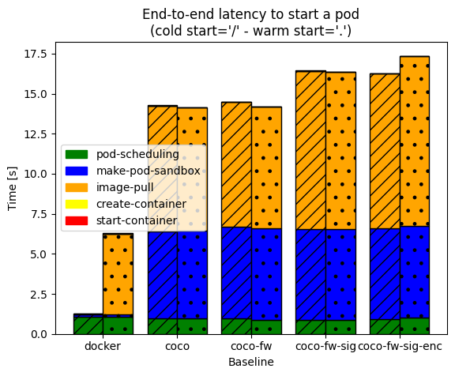

In addition, we also generate a breakdown pie chart for one of the runs in
[`./plots/sartup/breakdown.png`](./plots/startup/breakdown.png):

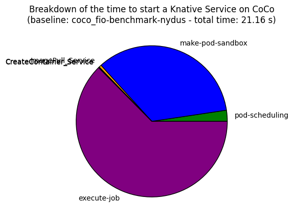

### Instantiation Throughput

In this experiment we measure the time it takes to spawn a fixed number of
Knative services. Each service uses the _same_ docker image, so it is a proxy
measurement for scale-up/scale-down costs.

In more detail, we template `N` different service files, apply all of them,
and wait for all associated service pods to be in `Ready` state. We report the
time between we apply all files, and the last service pod is `Ready`.

To run the benchmark, you may run:

```bash
inv eval.xput.run
```

and then plot the results with:

```bash
inv eval.xput.plot
```

which generates a plot in [`./plots/xput/xput.png`](
./plots/xput/xput.png). You can also see the plot below:

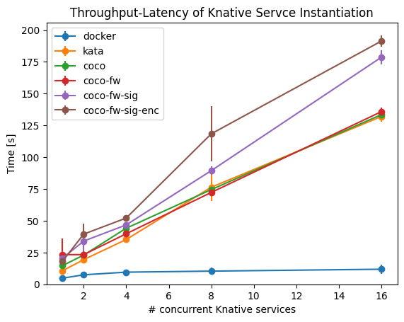

### Memory Size

This experiment explores the impact of the initial VM memory size on the
Knative service start-up time.

By initial VM memory size we mean the memory size passed to QEMU with the `-m`
flag. This size can be configured through the Kata configuration file.

To run the experiment you may run:

```bash
inv eval.mem-size.run
```

and plot the results with:

```bash
inv eval.mem-size.plot
```

which generates a plot in [`./plots/mem-size/mem_size.png`](
./plots/mem-size/mem_size.png). You can also see the plot below:

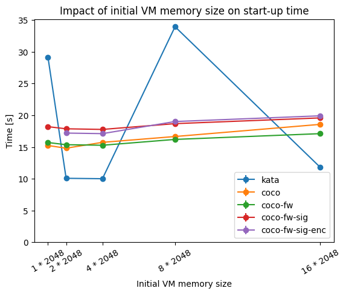

### Initrd Size

This experiment explores the impact of the `initrd` image size on the start-up
latency.

You may run the experiment using:

```bash
inv eval.initrd-size.run
```

and plot the results with:

```bash
inv eval.initrd-size.plot
```

which generates a plot in [`./plots/initrd-size/initrd_size.png`](
./plots/initrd-size/initrd_size.png). You can also see the plot below:

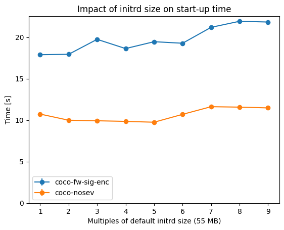

### VM Start-Up

This experiment further analyzes the costs associated to spinning up just the
confidential VM (as part of the Knative service instantiation).

To run this test, we want to enable `debug` logging on `containerd`, `kata`,
and `ovmf`:

```bash
inv containerd.set-log-level debug kata.set-log-level debug ovmf.set-log-level debug
```

In very brief summary, the events when booting a confidential VM (for CoCo) are
the following:
1. `containerd` calls the `RunPodSandbox` API
2. The `kata-shim` translates this call into a QEMU command to start a VM
3. In the process of starting a VM, pre-attestation happens and secrets are
  injected from the KBS
4. The VM is officially started, and OVMF boots into the kernel from the `initrd`
5. The Kernel calls the `/init` process, which in our case is the `kata-agent`
6. Once the `kata-agent` has started, it concludes the API `RunPodSandbox` call
for more detail on the OVMF boot process, see the [OVMF docs](../docs/ovmf.md).

To generate a flame graph-like plot with the detailed costs, you may run:

```bash
inv eval.vm-detail.run
```

and plot the results with:

```bash
inv eval.vm-detail.plot
```

which generates a plot in [`./plots/vm-detail/vm_detail.png`](
./plots/vm-detail/vm_detail.png). You can also see the plot below:

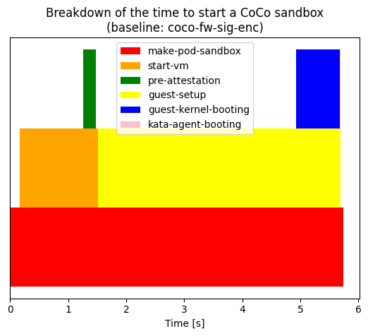

We also generate additional plots where we compare two flame graphs of the
start-up times of VMs with different configurations.

We have a plot comparing SEV vs no-SEV in [`./plots/vm-detail/vm_detail_multisev.png`](
./plots/vm-detail/vm_detail_multisev.png):

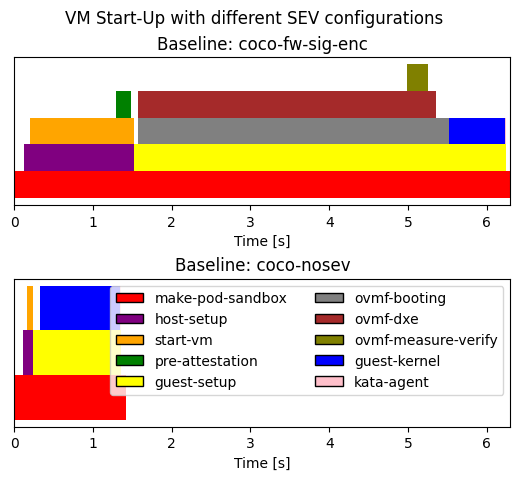

another one where we compare the impact of the inital VM memory size
[`./plots/vm-detail/vm_detail_multimem.png`](./plots/vm-detail/vm_detail_multimem.png):

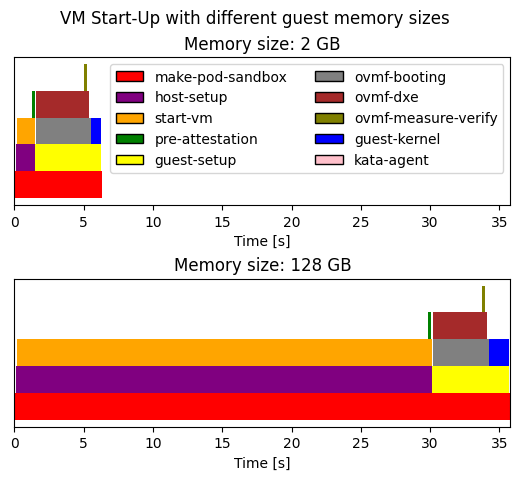

and another one where we compare the impact of the firmware size
[`./plots/vm-detail/vm_detail_multiovmf.png`](./plots/vm-detail/vm_detail_multiovmf.png):


### OVMF Detail

This experiment analyzes the sources of overhead when booting an SEV guest
using OVMF, compared to booting a non-SEV guest using OVMF too.

> [!WARNING]
> This plot is a WIP and we still do not know for sure what is going on.
> In addition, the scripts and OVMF patches are experimental so use at your
> own risk!
> See: https://github.com/csegarragonz/coco-serverless/issues/50

To run this experiment, you need to patch OVMF with an experimental patch and
set the rest of the logging levels accordingly:

```bash
inv containerd.set-log-level debug kata.set-log-level debug ovmf.set-log-level very-debug
```

then, you may run the experiment with:

```bash
inv eval.ovmf-detail.run
```

and plot the results with:

```bash
inv eval.ovmf-detail.plot
```

which generates a plot in [`./plots/ovmf-detail/ovmf_detail.png`](
./plots/ovmf-detail/ovmf_detail.png). You can also see the plot below:

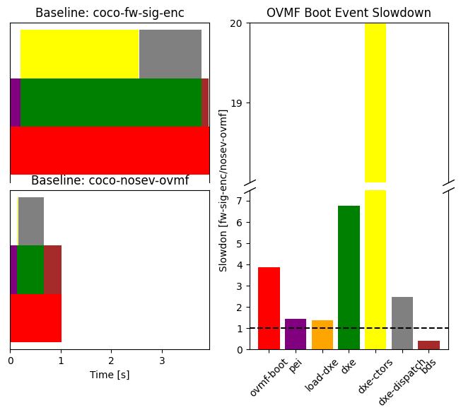

### Image Pull

This experiment breaks down the costs associated to pulling a container image
on the guest. We consider the baseline where all security features are
enabled. This means that the container images we use are both signed and
encrypted.

To get the timing measurements for the image pulling, we need to patch the
`image-rs` crate in the Kata Agent. We do so in our fork of the
[`guest-components`](https://github.com/csegarragonz/guest-components) repo.
To re-build the Kata Agent, you may see the [docs](./docs/kata.md), and then
run:

```bash
inv kata.replace-agent
```

In addition, we want to configure the right debug logging settings:

```bash
inv kata.set-log-level debug containerd.set-log-level debug ovmf.set-log-level info
```

After that, you may run the experiment with:

```bash
inv eval.image-pull.run
```

and plot the results with:

```bash
inv eval.image-pull.plot
```

which generates a plot in [`./plots/image-pull/image_pull.png`](
./plots/image-pull/image_pull.png). Note that, by default, the `image-rs`
crate will pull different layers concurrently. For each layer, fetching the
bytes from the internet, and decompressing (+ decrypting) them happens
(forcefully) in serial. Thus, to divide the time pulling layers (in general)
between time fetching bytes from the internet, and handling them, we aggreagte
the overall serial times for each operation, and calculate the ratio between
them.

You can see the plot below:

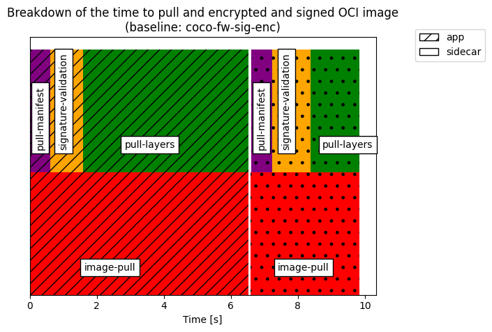

### Throughput Detail

In this experiment, we pick one of the baselines in the [instantiation throughput](
#instantiation-throughput) experiment, and try to analyze why the start-up
latency increases linearly with the number of concurrent requests.

To do so, we pick one of the data points in the aforementioned plot. In
particular, we pick the most secure baseline (`coco-fw-sig-enc`), and the
highest concurrency level (`16`), and record the timestamps of the basic VM
creation events (as reported in the [start-up costs](#start-up-costs) plot).

Given the amount of concurrent services, we want to use a more succinct
logging configuration:

```bash
inv kata.set-log-level info containerd.set-log-level info
```

> Note that, given the volume of services we spin up, getting the logs from
> `containerd` is unreliable, as `journalctl` will drop lines. Thus, for this
> experiment we use the slightly less precise Kubernetes event's timestamps.

To run the experiment you may run:

```bash
inv eval.xput-detail.run
```

and you may plot the results using:

```bash
inv eval.xput-detail.plot
```

which generates a plot in [`./plots/xput-detail/xput_detail.png`](
./plots/xput-detail/xput_detail.png). You can also see the plot below:

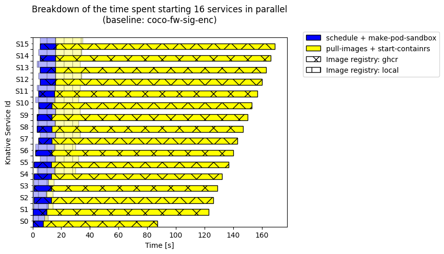

## Benchmarks

TODO
